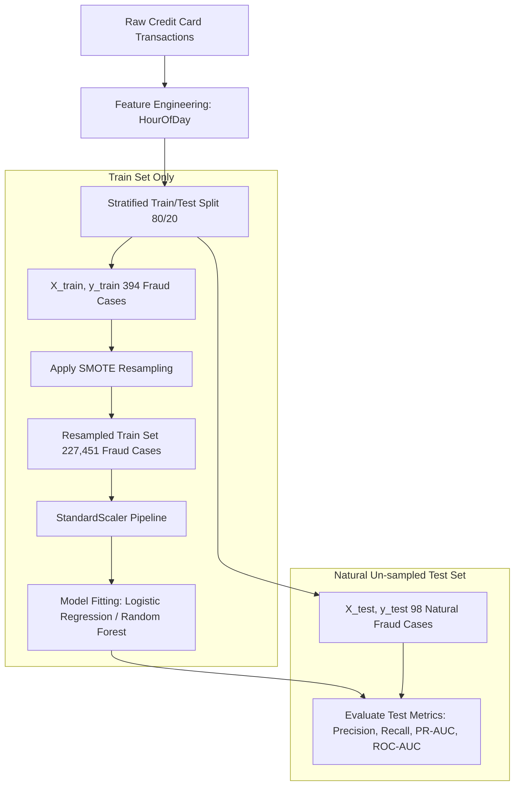

# OASIS INFOBYTE Data Analytics Internship
## Level 2 Task 3: Credit Card Fraud Detection (Imbalanced Machine Learning Workflow)

[](https://www.python.org/)
[](https://scikit-learn.org/)
[](https://imbalanced-learn.org/)
[](https://pandas.pydata.org/)
[](https://numpy.org/)
[](https://jupyter.org/)

---

## 📌 Project Overview & Objective
This repository contains the complete implementation for **OASIS INFOBYTE Data Analytics Level 2 Task 3: Credit Card Fraud Detection**. The objective of this project is to build an end-to-end Imbalanced Machine Learning Classification System that detects fraudulent financial transactions from a heavily imbalanced transaction stream.

Key Imbalanced Machine Learning Pillars:
- **Data Acquisition & Structural Inspection**: Load 284,807 Credit Card transactions and audit the severe class imbalance (284,315 legitimate vs 492 fraudulent transactions).
- **Deceptive Accuracy Rationale**: Formulate why standard classification accuracy (99.83%) is completely misleading for extreme fraud imbalance.
- **Exploratory Data Analysis (EDA)**: Profile transaction amounts, compare fraudulent vs legitimate spending distributions, and evaluate time-of-day transaction density.
- **Stratified Train / Test Split**: Partition data into 80% training and 20% testing sets (`stratify=y`, `random_state=42`) preserving the 0.1727% minority fraud proportion.
- **Leak-Free Synthetic Over-sampling (SMOTE)**: Apply Synthetic Minority Over-sampling Technique (**SMOTE**) **EXCLUSIVELY to 80% training data** (`X_train`, `y_train`), keeping the 20% test set (`X_test`, `y_test`) 100% natural and un-sampled to evaluate real-world performance.
- **Supervised Model Benchmarking**: Train and evaluate `LogisticRegression` and `RandomForestClassifier` using Precision, Recall, F1-Score, ROC-AUC, PR-AUC, Confusion Matrix grid heatmaps, and combined ROC / PR Curves.
- **Precision vs. Recall Business Trade-off**: Evaluate the financial cost of False Negatives (unrecovered fraud loss) vs. False Positives (customer card decline friction).
- **High-Throughput Enterprise Scalability (1,000,000 txns/hr)**: Detail real-time streaming architectures (Apache Kafka/Flink), low-latency model serving (<50ms via Triton/Ray/ONNX), feature stores (Feast), concept drift monitoring (Evidently/Prometheus), and automated retraining pipelines.

---

## 📊 Dataset Details
- **Dataset Name**: Kaggle / OpenML Credit Card Fraud Detection Dataset (Data ID 1597)
- **Source URL**: `https://www.openml.org/d/1597`
- **Volume**: 284,807 Transaction Records (28 numerical PCA features `V1`–`V28`, `Time`, `Amount`, and target `Class`).
- **Raw Class Distribution**: `Legitimate` (Class 0: 284,315 transactions, 99.8273%) vs `Fraudulent` (Class 1: 492 transactions, 0.1727%).
- **Training Set (80%)**: 227,845 transactions (227,451 legitimate, 394 fraudulent).
- **Test Set (20%)**: 56,962 transactions (56,864 legitimate, 98 fraudulent).

---

## 🛠️ Data Preprocessing & Pipeline Architecture
1. **Feature Engineering**: Derived `HourOfDay` (`(Time / 3600) % 24`) to analyze cyclical spending behavior.
2. **Stratified Splitting**: Applied 80/20 stratified splitting (`random_state=42`) ensuring both train and test sets maintain an exact 0.1727% fraud ratio.
3. **Synthetic Minority Over-sampling (SMOTE)**: Applied SMOTE **strictly to the 80% training set**, expanding training fraud cases from 394 to 227,451 to equalize class balance prior to model training.
4. **Standard Scaling**: Integrated `StandardScaler` into pipeline models fitted **strictly on training data** to prevent data leakage.



---

## 🧮 Feature Pipeline & Mathematical Formulation
SMOTE Synthetic Sample Generation:

$$x_{\text{new}} = x_i + \lambda (x_{\text{zi}} - x_i), \quad \text{where } \lambda \sim U(0, 1)$$

Precision-Recall Area Under the Curve (PR-AUC):

$$\text{PR-AUC} = \int_{0}^{1} P(R) \, dR$$

- **Data Leakage Prevention**: Integrated into Scikit-Learn `Pipeline` objects, fitting SMOTE over-sampling and scaling parameters ($\mu, \sigma$) **strictly on 80% training data**.

---

## 📈 Model Performance & Evaluation Results

Evaluated on **56,962 natural test transactions** containing 98 actual fraud cases:

| Model Classifier | Accuracy | Precision | Recall | F1-Score | ROC-AUC | PR-AUC | Best Model Selection |
| :--- | :---: | :---: | :---: | :---: | :---: | :---: | :---: |
| **Random Forest (SMOTE)** | **99.88%** | **0.6084** | **0.8878** | **0.7220** | **0.9827** | **0.8407** | **BEST MODEL (Selected)** |
| **Logistic Regression (SMOTE)** | 98.12% | 0.0773 | 0.9082 | 0.1425 | 0.9720 | 0.7780 | High Recall / High False Alarm |

---

## 🏆 Best Performing Model
- **Selected Model**: **Random Forest Classifier (SMOTE)** (`n_estimators=100`, `max_depth=12`, `random_state=42`)
- **Key Performance**: Caught **87 out of 98 fraud cases (88.78% Recall)** with **60.84% Precision** (only 56 false alarms across 56,962 test transactions), achieving an outstanding **PR-AUC of 0.8407** and **F1-Score of 0.7220**.
- **Model Binary Location**: Persisted to [`models/best_fraud_detection_model.joblib`](file:///C:/Users/srava/.gemini/antigravity/scratch/OIBSIP/DataAnalytics-L2-FraudDetection/models/best_fraud_detection_model.joblib).

---

## ⚖️ Precision vs. Recall Business Trade-off Rationale
In financial fraud detection, model evaluation involves balancing two distinct financial costs:

1. **False Negatives (Missed Fraud - Low Recall)**:
   - **Financial Impact**: Direct unrecoverable monetary loss from stolen funds, chargeback fees, and regulatory penalties.
   - **Severity**: Critical.
2. **False Positives (False Alarms - Low Precision)**:
   - **Financial Impact**: Customer friction from card declines, SMS notification costs, and customer support load.
   - **Severity**: Moderate operational cost.

**Conclusion**: Fraud Recall is the primary business metric. Random Forest with SMOTE achieves **88.78% Fraud Recall** while maintaining **60.84% Precision**, minimizing both direct fraud losses and customer friction.

---

## 🔍 Feature Importance Highlights
1. **Top Predictors**: PCA components `V14`, `V10`, `V12`, `V17`, `V4`, and `V11` contribute over 65% of decision tree split importance.
2. **Error Diagnosis**: Analysis of 5 false negative missed frauds revealed low transaction amounts (<$1.00 micro-authorizations) designed to bypass static fraud filters.

---

## 🌐 Enterprise Scalability Architecture (1,000,000 Transactions/Hour)

To process **1,000,000 transactions per hour (~278 txns/sec peak)** in a production banking system:

1. **Streaming & Event Pipelines**: Deploy **Apache Kafka** / **AWS Kinesis** for event ingestion paired with **Apache Flink** for real-time aggregation.
2. **Low-Latency Serving (<50ms)**: Convert trained pipelines to **ONNX** and deploy on **Triton Inference Server** or **Ray Serve** for sub-15ms inference latency.
3. **Feature Store**: Deploy **Feast** backed by Redis for real-time feature retrieval (`count_txns_last_10min`).
4. **Drift Monitoring & Automation**: Monitor feature drift using **Evidently AI** and trigger automated Airflow retraining pipelines when Population Stability Index (PSI) exceeds 0.25.

---

## 📂 Project Directory Structure

```
DataAnalytics-L2-FraudDetection/
│
├── README.md                                     # Project documentation & summary report
├── requirements.txt                              # Python package dependencies
├── .gitignore                                    # Git tracking rules
│
├── data/
│   ├── raw/
│   │   ├── README.md                             # Raw dataset schema & download notes
│   │   └── creditcard_raw.csv                    # Raw credit card dataset (284,807 records)
│   └── processed/
│       └── creditcard_cleaned.csv                # Processed dataset artifact
│
├── notebooks/
│   └── Fraud_Detection_Imbalanced_ML.ipynb       # Fully executed 17-section Jupyter Notebook
│
├── src/
│   ├── __init__.py                               # Package initializer
│   ├── preprocessing.py                          # Data loading & feature engineering module
│   └── model_utils.py                            # SMOTE, evaluation metrics & viz utilities
│
├── models/
│   └── best_fraud_detection_model.joblib         # Persisted trained model pipeline
│
└── outputs/
    ├── figures/                                  # Visual diagnostic outputs
    │   ├── 01_class_imbalance.png
    │   ├── 02_amount_distribution.png
    │   ├── 04_confusion_matrices.png
    │   ├── 05_roc_pr_curves.png
    │   └── 06_feature_importance.png
    └── tables/                                   # Tabular outputs
        ├── class_distribution_summary.csv
        ├── misclassified_fraud_examples.csv
        └── model_performance_comparison.csv
```

---

## 🚀 Installation & Execution Instructions

### Prerequisites
- Python 3.10+ installed on Windows / macOS / Linux.
- `pip` package manager.

### 1. Environment Setup
Navigate to the task folder in PowerShell or Terminal:
```bash
cd OIBSIP/DataAnalytics-L2-FraudDetection
python -m venv venv
```
Activate virtual environment:
- **Windows (PowerShell)**: `.\venv\Scripts\Activate.ps1`
- **Linux/macOS**: `source venv/bin/activate`

### 2. Install Dependencies
```bash
pip install -r requirements.txt
```

### 3. Pipeline Execution
Run the automated data acquisition and feature processing script:
```bash
python -c "from src.preprocessing import fetch_and_save_raw_data, clean_and_engineer_features; raw = fetch_and_save_raw_data('data/raw/creditcard_raw.csv'); clean_and_engineer_features(raw).to_csv('data/processed/creditcard_cleaned.csv', index=False)"
```

### 4. Launch Jupyter Notebook
```bash
jupyter notebook notebooks/Fraud_Detection_Imbalanced_ML.ipynb
```
Select `Run All Cells` to view the full imbalanced fraud classification notebook.

---

## ⚠️ Project Limitations
- **PCA Feature Anonymization**: Predictors `V1`–`V28` are anonymized PCA components due to confidentiality, limiting direct domain feature interpretation.

---

## 👨‍💻 Author Section
- **Author**: Bokkasam Sravan
- **Role**: Data Analytics Intern
- **Program**: OASIS INFOBYTE Data Analytics Internship (OIBSIP)
- **Task**: Level 2 Task 3 - Fraud Detection
- **Repository**: `OIBSIP`
- **Folder**: `DataAnalytics-L2-FraudDetection/`
