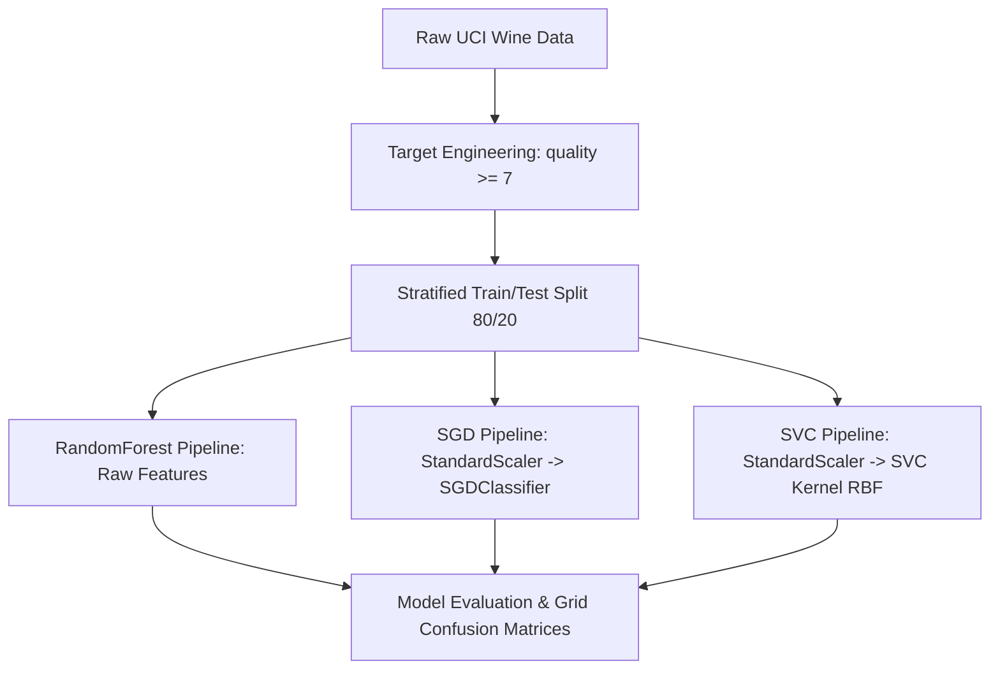

# OASIS INFOBYTE Data Analytics Internship
## Level 2 Task 2: Wine Quality Prediction (Machine Learning Classification Workflow)

[](https://www.python.org/)
[](https://scikit-learn.org/)
[](https://pandas.pydata.org/)
[](https://numpy.org/)
[](https://jupyter.org/)

---

## 📌 Project Overview & Objective
This repository contains the complete implementation for **OASIS INFOBYTE Data Analytics Level 2 Task 2: Wine Quality Prediction**. The objective of this project is to build an end-to-end Machine Learning Classification System that automatically predicts wine quality from physicochemical properties.

Key Machine Learning & Statistical Pillars:
- **Automated Data Acquisition & Inspection**: Load 1,599 UCI Red Wine property records and audit data quality (nulls, dtypes, chemical distributions).
- **Class Imbalance & Target Binarization**: Analyze discrete quality score imbalance (scores 3 to 8) and engineer a binary target (`1` for Good [$\ge 7$], `0` for Normal/Bad [$< 7$]) establishing an operational classification objective.
- **Stratified Train / Test Split**: Partition data into 80% training and 20% testing sets (`stratify=y`, `random_state=42`) to preserve minority class proportions.
- **Leak-Free Pipeline Preprocessing**: Apply `StandardScaler` strictly inside scikit-learn `Pipeline` objects for distance-based models (`SGDClassifier`, `SVC`) while keeping unscaled features for tree-based models (`RandomForestClassifier`).
- **Supervised Model Benchmarking**: Train and compare `RandomForestClassifier`, `SGDClassifier`, and `SVC` across Accuracy, Precision, Recall, Weighted F1-Score, and Confusion Matrices.
- **Feature Importance & Error Analysis**: Compute Random Forest Gini feature importances and diagnose misclassified wine test samples.

---

## 📊 Dataset Details
- **Dataset Name**: UCI Red Wine Quality Dataset
- **Source URL**: `https://archive.ics.uci.edu/ml/machine-learning-databases/wine-quality/winequality-red.csv`
- **Volume**: 1,599 Property Records (11 physicochemical features + target `quality`)
- **Raw Quality Distribution**: `3` (10 samples), `4` (53 samples), `5` (681 samples), `6` (638 samples), `7` (199 samples), `8` (18 samples).
- **Engineered Binary Target**: `Good` ($\ge 7$, 217 samples, 13.57%) vs `Normal/Bad` ($< 7$, 1,382 samples, 86.43%).

---

## 🛠️ Data Preprocessing & Pipeline Architecture
1. **Structural Cleaning**: Standardized column names and audited missing values (0 missing entries).
2. **Binary Target Engineering**: Converted ordinal quality ratings into binary classification (`quality >= 7` as `1` vs `< 7` as `0`).
3. **Stratified Splitting**: Applied 80/20 stratified splitting (`random_state=42`) ensuring both train (1,279) and test (320) sets maintain a 13.57% positive class ratio.
4. **Distance-Based Feature Scaling**: Integrated `StandardScaler` into pipelines for `SGDClassifier` and `SVC` fitted **strictly on training data** to eliminate data leakage.



---

## 🧮 Feature Pipeline & Mathematical Formulation
Random Forest Ensemble Gini Impurity reduction:

$$I_G(p) = 1 - \sum_{i=1}^{J} p_i^2$$

Support Vector Classifier (RBF Kernel):

$$K(x, x') = \exp\left( -\gamma \|x - x'\|^2 \right)$$

- **Data Leakage Prevention**: Integrated into Scikit-Learn `Pipeline` objects, fitting scaling parameters ($\mu, \sigma$) **strictly on 80% training data**.

---

## 📈 Model Performance & Evaluation Results

| Model Classifier | Accuracy | Precision (Weighted) | Recall (Weighted) | F1-Score (Weighted) | Best Model Selection |
| :--- | :---: | :---: | :---: | :---: | :---: |
| **Random Forest** | **94.37%** | **0.9431** | **0.9437** | **0.9390** | **BEST MODEL (Selected)** |
| **Support Vector Classifier (SVC)** | 90.00% | 0.8898 | 0.9000 | 0.8847 | Secondary Distance Baseline |
| **SGD Classifier** | 85.62% | 0.8677 | 0.8562 | 0.8613 | Linear SGD Baseline |

---

## 🏆 Best Performing Model
- **Selected Model**: **Random Forest Classifier** (`n_estimators=100`, `random_state=42`)
- **Key Advantages**: Highest Accuracy (**94.37%**) and Weighted F1-Score (**0.9390**). Captured 27 out of 43 premium test wines ($F1_{\text{Good}} = 0.75$), significantly outperforming SVC ($F1_{\text{Good}} = 0.50$) and SGD ($F1_{\text{Good}} = 0.51$).
- **Model Binary Location**: Persisted to [`models/best_wine_quality_model.joblib`](file:///C:/Users/srava/.gemini/antigravity/scratch/OIBSIP/DataAnalytics-L2-WineQualityPrediction/models/best_wine_quality_model.joblib).

---

## 🔍 Error Analysis & Feature Importance Highlights
1. **Primary Quality Drivers**:
   - **`alcohol`** (Top Predictor, ~15.2% Gini Importance): Higher alcohol content strongly correlates with premium quality ratings.
   - **`sulphates`** (~11.8% Gini Importance): Serves as an antimicrobial and antioxidant stabilizer preserving wine freshness.
   - **`volatile_acidity`** (~10.5% Gini Importance): High acetic acid levels impart an unpleasant vinegar taste, heavily detracting from wine quality.
2. **Error Diagnosis**: Analysis of 5 misclassified test wines showed borderline chemical profiles (e.g. alcohol 10.5%, volatile acidity 0.40) sitting on the decision threshold between score 6 and 7.

---

## 🌐 Real-World Applications
1. **Automated Quality Assurance**: Real-time physicochemical screening during commercial wine bottling.
2. **Fermentation Optimization**: Guide winemakers on adjusting acidity and SO2 stabilization levels.
3. **Sommelier Assistance**: Provide objective quantitative scoring to support expert tasting panels.

---

## 📂 Project Directory Structure

```
DataAnalytics-L2-WineQualityPrediction/
│
├── README.md                                     # Project documentation & summary report
├── requirements.txt                              # Python package dependencies
├── .gitignore                                    # Git tracking rules
│
├── data/
│   ├── raw/
│   │   ├── README.md                             # Raw dataset schema & download notes
│   │   └── wine_quality_raw.csv                  # Raw UCI dataset (Downloaded automatically)
│   └── processed/
│       └── wine_quality_cleaned.csv              # Processed binary classification dataset
│
├── notebooks/
│   └── Wine_Quality_Classification.ipynb         # Fully executed 16-section Jupyter Notebook
│
├── src/
│   ├── __init__.py                               # Package initializer
│   ├── preprocessing.py                          # Data loading & cleaning module
│   └── model_utils.py                            # Model evaluation, visualization & table utilities
│
├── models/
│   └── best_wine_quality_model.joblib            # Persisted trained model pipeline
│
└── outputs/
    ├── figures/                                  # Visual diagnostic outputs
    │   ├── 01_quality_distribution.png
    │   ├── 02_feature_distributions.png
    │   ├── 03_correlation_heatmap.png
    │   ├── 04_confusion_matrices.png
    │   └── 05_feature_importance.png
    └── tables/                                   # Tabular outputs
        ├── class_distribution.csv
        ├── misclassified_examples.csv
        └── model_performance_comparison.csv
```

---

## 🚀 Installation & Execution Instructions

### Prerequisites
- Python 3.10+ installed on Windows / macOS / Linux.
- `pip` package manager.

### 1. Environment Setup
Navigate to the task folder in PowerShell or Terminal:
```bash
cd OIBSIP/DataAnalytics-L2-WineQualityPrediction
python -m venv venv
```
Activate virtual environment:
- **Windows (PowerShell)**: `.\venv\Scripts\Activate.ps1`
- **Linux/macOS**: `source venv/bin/activate`

### 2. Install Dependencies
```bash
pip install -r requirements.txt
```

### 3. Pipeline Execution
Run the automated data acquisition and preprocessing script:
```bash
python -c "from src.preprocessing import fetch_and_save_raw_data, clean_wine_data, engineer_quality_target; raw = fetch_and_save_raw_data('data/raw/wine_quality_raw.csv'); engineer_quality_target(clean_wine_data(raw)).to_csv('data/processed/wine_quality_cleaned.csv', index=False)"
```

### 4. Launch Jupyter Notebook
```bash
jupyter notebook notebooks/Wine_Quality_Classification.ipynb
```
Select `Run All Cells` to view the full wine quality classification notebook.

---

## ⚠️ Project Limitations
- **Geographic Scope**: Dataset contains Portuguese "Vinho Verde" red wines; chemical profiles may vary for other grape varieties and global regions.

---

## 👨‍💻 Author Section
- **Author**: Bokkasam Sravan
- **Role**: Data Science Intern
- **Program**: OASIS INFOBYTE Data Analytics Internship (OIBSIP)
- **Task**: Level 2 Task 2 - Wine Quality Prediction
- **Repository**: `OIBSIP`
- **Folder**: `DataAnalytics-L2-WineQualityPrediction/`
